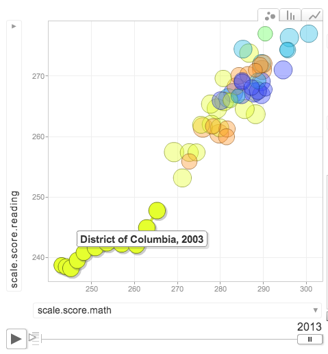

## NAEP: The Nation's Report Card

The National Assessment of Educational Progress (NAEP) measures student
achievement across the United States using standardized tests in a variety of
subjects. NAEP is not a test of *individual* or even school-level achievement;
it measures how students throughout the country are achieving, with breakouts
for some tests by state, race, gender, and socioeconomic status.

---

## NAEP Differs from "High-Stakes" State Tests

Some key features of NAEP that distinguish it from some other standardized
tests that are widely discussed in K-12 education, especially so-called
"high stakes" state tests:

- NAEP is a *sample*. Not all students are tested.
- NAEP can be used to directly compare states. Unlike the annual tests mandated
by No Child Left Behind, the same tests are used from state to state. However,
the state results include only public school students, not those in private
schools.
- NAEP provides only limited ability to compare U.S. students to their
counterparts in other countries, via the NAEP-TIMSS Linking Study. It is most
useful for comparisons within the United States.

--- .class #id 

## Scores Grew Modestly 2003-2013

```{r, echo=FALSE}
library(data.table)
naep <- fread("../../code/naep/naep_clean.csv")
math.growth.8 <- naep[year == 2013 & gender == "all" & grade == 8,
                    scale.score.math] /
        naep[year == 2003 & gender == "all" & grade == 8, scale.score.math]
reading.growth.8 <- naep[year == 2013 & gender == "all" & grade == 8,
                         scale.score.reading] /
        naep[year == 2003 & gender == "all" & grade == 8, scale.score.reading]
pct.math.8 <- round((mean(math.growth.8) - 1) * 100, 2)
pct.reading.8 <- round((mean(reading.growth.8) -1) * 100, 2)

dc.growth.8 <- round((naep[year == 2013 & gender == "all" & grade == 8 &
                            state == "District of Columbia", scale.score.math] /
        naep[year == 2003 & gender == "all" & grade == 8 &
                     state == "District of Columbia", scale.score.reading]
        - 1) * 100, 2)
```

The [NAEP Visualizer](http://skitalets.shinyapps.io/naep/) allows users to
see growth in scores on NAEP's math and reading from 2003-2013. During that
ten-year period, scores grew modestly, increasing on average `r pct.math.8`
percent in math and `r pct.reading.8` percent in reading.



The average growth masks interesting variability among states that is worth
exploring. For example, as the screenshot above shows, the District of
Columbia's public school students improved by `r dc.growth.8` percent in math
during the same period. The visualizer helps see how individual states move.

--- &radio

## Test Your NAEP Knowledge

NAEP allows users to make useful comparisons of achievement between which
groups on multiple subjects and grade-levels (choose the best answer).

1. American and Finnish girls.
2. Utahn and Bay Stater boys in private schools.
3. _Virginian and Hawaiian girls in public schools._
4. Boys and girls with red hair in public schools across the United States.

*** .hint
NAEP measures very specific types of achievement. Not all subgroups are included
in the NAEP tests.

*** .explanation
NAEP provides data on public school students only in the state results. Hair
color is not one of NAEP's subgroups. While limited international comparisons
are possible via the NAEP-TIMSS Linking Study, only a small number of
grade/subject/year combinations is available.
